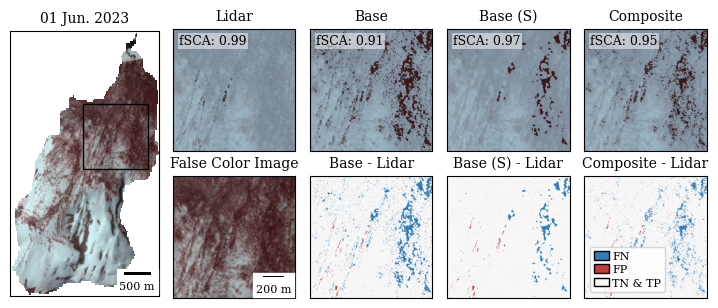
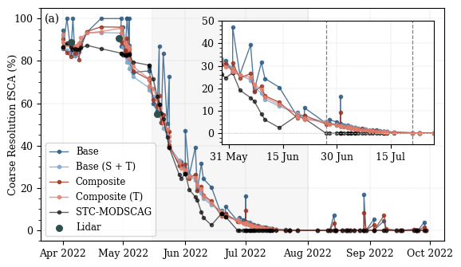

# Tools for mapping snow cover with 4 band PlanetScope imagery in complex and forested terrain

This repository contains notebooks to download 4 band PlanetScope imagery, Train two different Random Forest models (Base and Composite), post-process the PlanetScope snow cover maps to improve snow detection in the forests, and compare to a coarser- resolution freely available snow cover product.

Notebooks Include:
0_PlanetDownload.ipynb - Downloading PlanetScope imagery
1_classify_train_model.ipynb - Training Random Forest Model
2_process_SCA.ipynb - Run snow cover classifications
3_post_processing.ipynb - Snow cover map stacking and post-processing

4_modscag_comparison.ipynb - Compare PlanetScope snow cover maps to STC-MODSCAG

